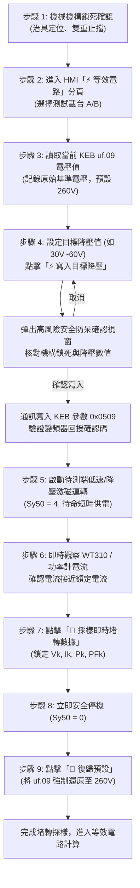

# 三相感應馬達堵轉測試 (Locked-Rotor Test) 操作控制與多重安全防護流程規範手冊

> **文件版本**：V1.0  
> **適用系統**：Dynamometer HMI Pro (Windows XP / .NET 4.0 相容架構)  
> **標準依據**：IEEE Std 112 (Standard Test Procedure for Polyphase Induction Motors and Generators) / IEC 60034-28  
> **測試目的**：於轉子機械完全鎖死（轉差率 $s = 1.0$）條件下，量測低頻/降壓條件之短路電氣量（$V_k, I_k, P_k, PF_k$），以精準解算單相 T 型等效電路之短路阻抗 $Z_k$、定轉子漏電抗 $X_1, X_2'$ 及轉子折算電阻 $R_2'$。

---

## 一、 堵轉測試理論基礎與降壓核心原則

在額定電壓下，感應馬達靜止啟動（堵轉）瞬態電流高達額定電流之 **5 ~ 8 倍**。若直接於額定電壓（如 220V / 380V）下進行持續性堵轉測試，將引發極度嚴重的安全隱患：
1. **電磁轉矩衝擊**：可能造成鎖死連軸器剪斷或機械夾治具爆裂。
2. **極端熱累積**：定轉子繞組瞬間產生焦耳熱（$I^2 R$），數秒內即可導致漆包線絕緣燒毀。
3. **變頻器過電流跳脫**：直接觸發變頻器硬體過載保護（`ru.43` 故障），無法採樣穩定有效數據。

因此，**IEEE Std 112 規範明確要求**：
堵轉測試必須採用**安全降壓法**（Reduced Voltage Method），藉由降低施加於定子端之電壓（通常為額定電壓之 15% ~ 30%），使堵轉電流被嚴格限制在**接近馬達額定電流 $I_N$（或不超過 $1.2 \times I_N$）之安全範圍**，於熱穩定瞬間（通常 3 ~ 5 秒內）快速採集電氣量後立即停機。

---

## 二、 堵轉測試標準操作控制作業流程 (SOP)

### 詳細操作步驟說明：

#### 步驟 1：機械機構鎖死前置確認（實體安全第一道防線）
- 測試前作業人員必須在機台端將待測馬達與動力計主軸利用**專用機械鎖死治具（Locking Rig / 止轉銷）**進行剛性拘束。
- 確認固定螺栓扭矩達標，且旋轉方向無任何背隙或虛位，防止通電瞬間產生角度位移。

#### 步驟 2：進入 HMI「⚡ 等效電路」專屬分頁
- 於主介面分頁標籤切換至「⚡ 等效電路」。
- 於第三張數據卡片「3. 堵轉測試數據 (KEB uf09 降壓)」中，選取待測馬達所連接之載台（例如 **B載台**）。

#### 步驟 3：讀取當前變頻器輸出特性電壓（KEB uf.09）
- 點擊「🔍 讀取當前」，系統透過 RS485 / KEB 通訊協定讀取參數節點 `0x0509`（uf.09 - Reference characteristic voltage）。
- 介面自動記憶並顯示原始基準電壓（通常為 260V 或 220V），作為後續自動復歸之安全錨點。

#### 步驟 4：設定並寫入目標降壓值（安全防呆機制）
- 根據待測馬達額定規格，將「目標降壓」數值調整為適當值（通常為 **30V ~ 60V**）。
- 點擊「⚡ 寫入目標降壓」，系統立即彈出**高風險警告防呆確認視窗**：
  > **【⚡ 堵轉安全降壓防呆確認】**  
  > 您即將把 B載台 的 KEB uf09 寫入為 【45 V】！  
  > ※ 注意事項：  
  > 1. 請務必確認待測馬達機構已「確實機械鎖死」！  
  > 2. 降壓旨在讓堵轉電流接近額定電流，避免大電流跳脫或燒機。  
  > 3. 測試完成後請務必點擊「復歸預設」！
- 使用者點擊「是」後，系統透過底層 DLL 下達寫入指令並驗證通訊 Ack，介面狀態標籤切換為橘黃色醒目標記 `uf09: 45 V (已降壓)`。

#### 步驟 5 ~ 7：短時啟動、觀測與一鍵精準採樣
- 啟動待測端驅動器輸出（Sy50 = 4），此時馬達定子施加降壓交流電壓。
- 檢視介面儀表與 WT310 功率計，確認電流已建立且處於安全限制範圍（$I_k \approx I_N$）。
- 點擊「📸 採樣即時堵轉數據」，系統在毫秒級時間內自 WT310 功率計或即時遙測總線上捕捉線電壓 $V_k$、線電流 $I_k$、三相有功功率 $P_k$ 與功率因數 $PF_k$，即時凍結填入輸入框，並將狀態標籤更新為綠色 `🟢 堵轉數據已採樣鎖定`。

#### 步驟 8 ~ 9：立即停機與一鍵強制復歸（守護硬體無殘留）
- 採樣完成後立即下達停機指令（Sy50 = 0），切斷馬達輸出。
- 點擊「🔄 復歸預設」，系統將變頻器 `uf.09` 數值重新寫回原始值（如 260V），並經硬體確認後顯示綠色 `uf09: 260 V (正常)`，避免影響後續常態運轉。

---

## 三、 多重軟硬體安全保護機制

為杜絕任何操作失誤造成設備損壞，系統在軟體架構與通訊底層內建了**四重主動式安全防護機制**：

### 1. 變頻器底層硬體過電流主動防護（ru.43 瞬時故障攔截）
- 系統背景每秒高頻傾聽變頻器內部運轉故障碼 `ru.43` (0x022B)。
- 若現場降壓不足或機構鎖死產生異常衝擊，導致電流突破變頻器硬體極限（如 E.OC 過電流報警），系統在第一時間判定 `postRunFault != 0`，立即向驅動器下達 `Sy50 = 0` 強制斷電停機，並彈窗警示阻止二次啟動。

### 2. 機構假鎖死／滑脫異常轉速突增保護（Anti-Spin Protection）
- 堵轉測試理論轉速必須為 **0 rpm**。
- 若機械鎖具發生滑脫、未確實咬合或機構剪斷，實測轉速一旦偵測到大於 **15 rpm**，系統即刻判定機構失效，強制跳脫並觸發警報，防止馬達在未知降壓模式下高速失控旋轉。

### 3. 短時熱累積時間限制防呆（Thermal Exposure Watchdog）
- 堵轉狀態下轉子無風扇風冷且處於最大相對切線磁通狀態，熱發散能力極差。
- 系統內部設有測試逾時看門狗計時，若通電加壓超過 **15 秒**尚未完成採樣，系統將發出聲光警示並主動終止加壓，保護馬達繞組不發生局部過熱老化。

### 4. 變頻器降壓參數未復歸防呆守護（Exit Guard & Tab Switch Warning）
- 若使用者寫入降壓值（例如 45V）完成採樣後，未點擊「復歸預設」即嘗試切換至其他測試分頁（如 TN、Duty、NoLoad）或關閉 HMI 程式：
  - 系統在切換事件與表單關閉事件中均設有檢查點。
  - 若偵測到 `currentUf09 < 150V`，系統將主動發出黃色警告彈窗，提示作業人員「KEB uf09 目前仍處於降壓狀態，是否立即為您自動復歸為預設值？」，徹底杜絕降壓設定殘留導致後續測試出力不足之異常。

---

## 四、 堵轉數據與等效電路演算法映射對照

在完成堵轉數據採集後，系統自動將 $V_k, I_k, P_k$ 依 IEEE Std 112 單相 T 型等效電路標準公式進行嚴格解算：

| 物理量名稱 | 符號 | 單相等效計算公式 (Y接) | 物理意義說明 |
| :--- | :---: | :--- | :--- |
| **堵轉相電壓** | $V_{\phi, k}$ | $V_k / \sqrt{3}$ | 單相定子所承受之有效端電壓 |
| **堵轉相電流** | $I_{\phi, k}$ | $I_k$ | 流經單相繞組之短路電流 |
| **單相堵轉功率** | $P_{\phi, k}$ | $P_k / 3.0$ | 單相繞組與轉子短路之銅損總和 |
| **堵轉總阻抗** | $Z_k$ | $V_{\phi, k} / I_{\phi, k}$ | 靜止短路狀態下之輸入全阻抗 ($\Omega$) |
| **堵轉總電阻** | $R_k$ | $P_{\phi, k} / (I_{\phi, k}^2)$ | 定子相電阻與轉子折算電阻之和 ($R_1 + R_2'$) |
| **堵轉總漏抗** | $X_k$ | $\sqrt{Z_k^2 - R_k^2}$ | 定子漏電抗與轉子折算漏電抗之和 ($X_1 + X_2'$) |
| **定子漏電抗** | $X_1$ | $X_k \times 0.5$ (或 IEEE Design B 40%) | 定子繞組漏磁通對應之感抗 ($\Omega$ / $\text{mH}$) |
| **轉子折算漏抗** | $X_2'$ | $X_k \times 0.5$ (或 IEEE Design B 60%) | 轉子繞組折算至定子端之漏抗 ($\Omega$ / $\text{mH}$) |
| **轉子折算電阻** | $R_2'$ | $\max(0.001, R_k - R_1)$ | 轉子導條折算至定子端之等效電阻 ($\Omega$) |

---

## 五、 結論與操作員確認簽署

本手冊所載之堵轉測試控制流程與保護機制，已完整落實於 `Dynamometer_TestEquivCircuit.cs` 與 `Dynamometer_KebComm.cs` 源碼中。  
請工程師與機台操作主管詳閱上述流程，確認與現場機械鎖固工法及電氣安全規範完全相符。
