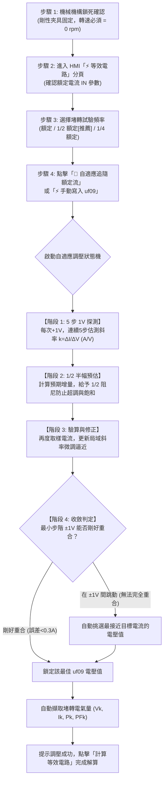

# 三相感應馬達堵轉測試 (Locked-Rotor Test) 操作控制與多重安全防護流程規範手冊

> **文件版本**：V2.0 (多頻測試、自適應調壓閉迴路與精準閾值保護升級版)  
> **適用系統**：Dynamometer HMI Pro (Windows XP / .NET 4.0 相容架構)  
> **標準依據**：IEEE Std 112 (Standard Test Procedure for Polyphase Induction Motors) / IEC 60034-2-1  
> **測試目的**：於轉子機械完全鎖死（轉差率 $s = 1.0$）條件下，量測不同測試頻率（額定頻率、1/2 頻率、1/4 頻率）與降壓條件下之短路電氣量（$V_k, I_k, P_k, PF_k$），解算單相 T 型等效電路之短路阻抗 $Z_k$、定轉子漏電抗 $X_1, X_2'$、換算漏電感 $L_1, L_2' (\text{mH})$ 及轉子折算電阻 $R_2'$。

---

## 一、 堵轉測試理論基礎與多頻率試驗規範

### 1. 為什麼必須採用安全降壓法？
在額定全電壓下，三相感應馬達靜止啟動（堵轉）瞬態電流高達額定電流的 **5 ~ 8 倍**。直接於額定電壓下進行持續堵轉測試會造成極度危險的破壞：
1. **破壞性電磁轉矩衝擊**：可能剪斷軸心、聯軸器或摧毀機械夾治具。
2. **劇烈熱累積 (焦耳熱 $I^2 R$)**：定轉子繞組在數秒內溫度飆升，極易使漆包線絕緣碳化燒毀。
3. **變頻器過電流跳脫**：直接觸發硬體瞬時保護，無法穩定捕捉電氣量。

因此，**IEEE Std 112 規範明確要求採用安全降壓法**：將定子端輸入電壓降低（通常為額定電壓之 10% ~ 25%），使堵轉電流被精準控制在**額定電流 $I_N$ 附近**，於電氣平衡瞬間快速取樣後立即停機。

### 2. 多種試驗頻率的選擇與電機物理意義
IEEE Std 112 第 9.2 節明確指出，大中型深槽或雙鼠籠感應馬達在額定頻率堵轉時，強烈的轉子導條「集膚效應 (Skin Effect)」會迫使轉子電流集中在導條槽頂，導致測得的轉子等效漏抗偏小、轉子電阻偏大。為獲取真實運轉轉差率下的漏抗，規範推薦多種頻率測法：

| 測試頻率模式 | 推薦適用場景 | 折算比 ($f_0 / f_{test}$) | 電機物理優勢與處理 |
| :--- | :--- | :--- | :--- |
| **額定頻率 ($f_N$, 如 50/60 Hz)** | 小型一般感應馬達 (集膚效應不明顯) | **1.0x** | 直接依實測值計算，無需頻率折算。 |
| **1/2 額定頻率 ($f_N/2$, 如 25/30 Hz)** | **標準推薦試驗模式 (IEEE Std 112 首選)** | **2.0x** | 大幅減輕轉子集膚效應與飽和，解算後自動線性折算回額定頻率漏抗。 |
| **1/4 額定頻率 ($f_N/4$, 如 12.5/15 Hz)** | 大型高壓、深槽、雙鼠籠特殊馬達 | **4.0x** | 接近實際微小運轉轉差率之磁通分佈，折算精準度最高。 |

#### 頻率與電抗折算數學契約：
若在測試頻率 $f_{test}$ 下測得堵轉漏抗為 $X_{k,meas} = \sqrt{Z_{k,meas}^2 - R_{k,meas}^2}$，則折算至額定頻率 $f_N$ 之等效漏抗與漏電感計算公式如下：
$$X_k(f_N) = X_{k,meas} \times \left(\frac{f_N}{f_{test}}\right) = \frac{X_{k,meas}}{\text{Ratio}}$$
$$L_k(\text{mH}) = \frac{X_{k,meas}}{2\pi f_{test}} \times 1000 \quad (\text{物理固有量，在各頻率下恆定})$$
$$X_1(f_N) = 0.5 \times X_k(f_N), \quad X_2'(f_N) = 0.5 \times X_k(f_N)$$
$$L_1(\text{mH}) = 0.5 \times L_k(\text{mH}), \quad L_2'(\text{mH}) = 0.5 \times L_k(\text{mH})$$

---

## 二、 堵轉測試標準操作與自動自適應調壓 SOP



### 1. 自適應動態調壓演算法細節 (類似扭力追隨閉迴路)
為杜絕傳統手動給定單一電壓時造成的電流過大或反覆試湊，系統內建**高精度漸進自適應調壓引擎**：
1. **起步安全防護**：
   - 啟動前即刻檢測軸轉速，若實測轉速 $> 5\text{ rpm}$，系統自動中斷並警示「軸未鎖死，禁止啟動」。
   - 自動將 `uf.09` 設定為極低安全電壓（預設 $12\text{V}$），避免高壓直接衝擊。
2. **階段 1 (5 步 1V 斜率探測)**：
   - 每間隔 1.0 秒將 `uf.09` 增加 1V（即 $V, V+1, V+2, V+3, V+4, V+5$）。
   - 記錄每一步的實測電流響應，計算局域電氣斜率：
     $$k = \frac{\Delta I}{\Delta V} \quad (\text{A/V})$$
3. **階段 2 (目標預估與 1/2 阻尼半幅逼近)**：
   - 根據目標額定電流 $I_N$ 與當前實測電流 $I_{cur}$，預估所需總電壓增量：
     $$\Delta V_{pred} = \frac{I_N - I_{cur}}{k}$$
   - **核心阻尼策略**：先給予預期電壓增量的 **$1/2$**（$V_{next} = V_{cur} + 0.5 \times \Delta V_{pred}$），有效防止感應馬達漏抗磁路非線性飽和引起的電流暴衝與超調。
4. **階段 3 (驗算與動態斜率更新)**：
   - 寫入 $V_{next}$ 後取樣電流，計算實際增加量與預期之偏差，更新斜率 $k$。
   - 再次給予微步修正，逐步平穩逼近目標電流帶。
5. **階段 4 (極限微調與最接近值鎖定)**：
   - 當調壓逼近至極限時，可能因為變頻器最小輸出解析度為 1V，使得 $V$ 伏特時為 $I_N - 0.2\text{A}$，而 $V+1$ 伏特時為 $I_N + 0.3\text{A}$（物理上無法剛好完全重合）。
   - **最接近值收斂抉擇**：系統自動比較 $V$ 與 $V+1$ 的偏差絕對值，**選定與目標電流最接近的電壓值作為最終收斂點**。
   - 收斂完成後，系統自動觸發「📸 擷取數據」鎖定電氣量，並顯示收斂偏差提示（例如 `🟢 調壓收斂完成: uf09=38V, Ik=32.2A (誤差 0.1A)`）。

---

## 三、 全方位即時雙重安全防護機制 (透明告警與日誌追溯)

所有安全防護機制均由後台專屬看門狗計時器（`tmrLockedWatchdog`，500ms 高頻輪詢）嚴密監控。一旦觸發跳脫，系統立即執行**三步處置**：
1. **立即下達 `Sy.50 = 0` 切斷變頻器輸出**（停止馬達定子激磁）。
2. **強制將 KEB `uf.09` 輸出電壓降至最低安全值 0 V**。
3. **中止自適應調壓程序**。

> [!IMPORTANT]
> **透明化告警承諾 (零誤會軟體 BUG)**：  
> 當任何保護機制觸發時，系統**絕對不會無聲停機或跳出無意義代碼**，而是強制彈出完整的「⚠️ 堵轉安全防護機制緊急跳脫」對話框，清楚列出**觸發保護類型、基準參數、實測數值與持續秒數**，讓作業人員明確知曉是哪一項物理保護生效，並同步於單一整合日誌 (`WriteHmiLog`) 中詳細記錄。

### 1. 電流閾值超標且持續 10 秒保護 (Over-Current Protection)
* **保護原理**：感應馬達堵轉時無自冷風扇且磁通集中，長時間大電流必導致繞組絕緣熱崩潰。
* **參考基準**：以馬達**額定電流 $I_N$**（卡片 2 輸入值）為基準。
* **觸發條件**：
  $$\text{實測電流 } I_k > 1.10 \times I_N \quad (\text{超過額定電流 } 10\%) \quad \text{且持續時間 } \ge 10.0 \text{ 秒}$$
* **彈出對話框範例**：
  ```text
  ⚠️【堵轉安全防護機制緊急跳脫·非軟體異常】

  觸發保護類型：堵轉過電流超時保護 (Over-Current > 110% IN)

  【實測數據與觸發條件】：
  • 基準額定電流 IN = 32.30 A
  • 過電流保護閥值 (110%) = 35.53 A
  • 實測堵轉電流 = 36.80 A (超標 1.27 A)
  • 累計超標時間 = 10.0 秒 (已達 10 秒跳脫上限)

  【🛡️ 系統已主動完成處置措施】：
  1. 已立即下達 Sy.50 = 0 切斷變頻器輸出 (停止定子激磁)
  2. KEB uf.09 輸出電壓已強制安全降為 0 V
  3. 自適應調壓程序已安全中止

  ※ 說明：此為保護馬達不致過熱燒毀之主動安全機制，非程式 BUG。
  請確認待測馬達冷卻狀況與調壓設定後，再行測試。
  ```

### 2. 轉速異常大於 5 rpm 且持續 3 秒保護 (治具脫扣防護)
* **保護原理**：堵轉測試之絕對先決條件為轉子機械剛性鎖死。若固定螺栓滑牙、聯軸器剪斷或操作人員未鎖死治具，通電後馬達將被迫旋轉，可能造成人員夾傷、線路纏繞或劇烈甩出。
* **觸發條件**：
  $$\text{實測扭力計軸轉速 } n > 5.0\text{ rpm} \quad \text{且持續時間 } \ge 3.0 \text{ 秒}$$
* **彈出對話框範例**：
  ```text
  ⚠️【堵轉安全防護機制緊急跳脫·非軟體異常】

  觸發保護類型：堵轉轉速異常跳脫 (治具脫扣/機械鎖死失效)

  【實測數據與觸發條件】：
  • 實測扭力計軸轉速 = 42 rpm (容許上限 5 rpm)
  • 累計轉動時間 = 3.0 秒 (已達 3 秒跳脫上限)
  • 判定結果：待測馬達機械鎖死治具已脫扣或未能承受堵轉扭力！

  【🛡️ 系統已主動完成處置措施】：
  1. 已立即下達 Sy.50 = 0 切斷變頻器輸出 (停止定子激磁)
  2. KEB uf.09 輸出電壓已強制安全降為 0 V
  3. 自適應調壓程序已安全中止

  ※ 說明：為防止機件高速旋轉飛脫造成重大工安意外，系統已主動保護跳脫。
  請確實鎖死治具確認無旋轉虛位後，再行測試。
  ```

### 3. 一鍵緊急停機與復歸防護 (Manual Emergency Stop)
* 面板隨時常駐紅底白字「🛑 緊急停機」按鈕，操作人員發現任何異狀點擊即可立即在 50ms 內中斷變頻器並歸零 `uf.09`。
* 測試完成後點擊「復歸預設」，一鍵還原原始電壓（260V），防止影響後續一般負載運轉。

---

## 四、 堵轉數據與等效電路參數推導公式全覽

完成堵轉數據採樣後，點擊「🚀 計算等效電路參數」，演算法執行下列 IEEE Std 112 標準計算：

1. **單相對稱短路電氣量解算 (Y 接基準)**：
   $$V_{phase,k} = \frac{V_k}{\sqrt{3}}, \quad I_{phase,k} = I_k, \quad P_{phase,k} = \frac{P_k}{3}$$
2. **測試頻率下總阻抗與短路電阻**：
   $$Z_k = \frac{V_{phase,k}}{I_{phase,k}}, \quad R_k = \frac{P_{phase,k}}{I_{phase,k}^2}$$
3. **實測測試頻率下漏電抗**：
   $$X_{k,meas} = \sqrt{Z_k^2 - R_k^2}$$
4. **多頻率折算回額定基準頻率 ($f_N$)**：
   $$X_k(f_N) = X_{k,meas} \times \left(\frac{f_N}{f_{test}}\right)$$
5. **換算堵轉總漏電感 ($\text{mH}$)**：
   $$L_k(\text{mH}) = \frac{X_{k,meas}}{2\pi f_{test}} \times 1000$$
6. **定轉子參數 50% / 50% 標準分配**：
   $$R_1 = 0.5 \times R_k \quad (\text{或依直流冷態電阻實測值給定})$$
   $$R_2' = R_k - R_1 \quad (\text{轉子折算電阻})$$
   $$X_1(f_N) = 0.5 \times X_k(f_N), \quad X_2'(f_N) = 0.5 \times X_k(f_N)$$
   $$L_1(\text{mH}) = 0.5 \times L_k(\text{mH}), \quad L_2'(\text{mH}) = 0.5 \times L_k(\text{mH})$$

所有計算成果同步顯示於參數清單表格、GDI+ 向量電路圖解中，並可一鍵匯出 CSV 報表或複製至剪貼簿！
