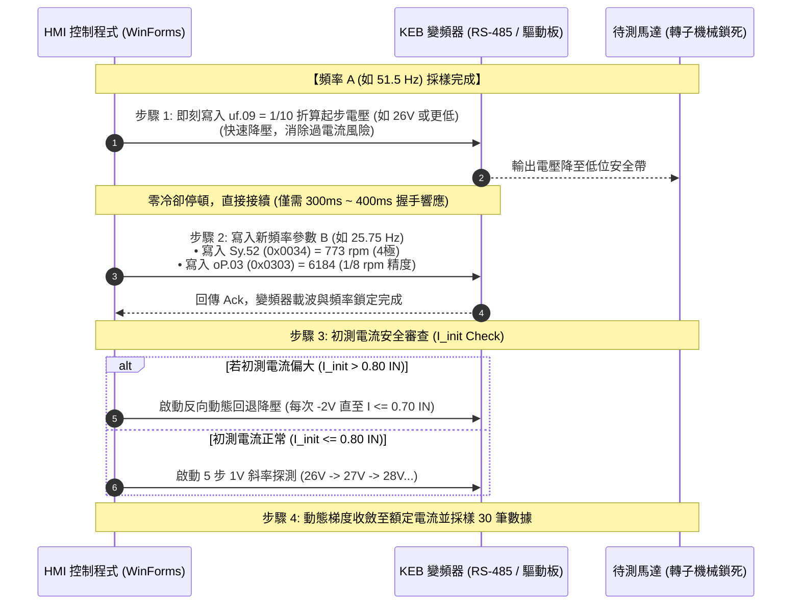

# 三相感應馬達堵轉測試 (Locked-Rotor Test) 操作控制與多重安全防護流程規範手冊

> **文件版本**：V2.1 (多頻無縫切換、SY.52 轉速映射、低頻電流防護與阻抗繼承升級版)  
> **適用系統**：Dynamometer HMI Pro (Windows XP / .NET 4.0 相容架構)  
> **標準依據**：IEEE Std 112 (Standard Test Procedure for Polyphase Induction Motors) / IEC 60034-2-1  
> **測試目的**：於轉子機械完全鎖死（轉差率 $s = 1.0$）條件下，量測不同測試頻率（額定頻率、1/2 頻率、1/4 頻率及多頻率點）與降壓條件下之短路電氣量（$V_k, I_k, P_k, PF_k$），解算單相 T 型等效電路之短路阻抗 $Z_k$、定轉子漏電抗 $X_1, X_2'$、換算漏電感 $L_1, L_2' (\text{mH})$ 及轉子折算電阻 $R_2'$。

---

## 一、 堵轉測試理論基礎與多頻率試驗規範

### 1. 為什麼必須採用安全降壓法？
在額定全電壓下，三相感應馬達靜止啟動（堵轉）瞬態電流高達額定電流的 **5 ~ 8 倍**。直接於額定電壓下進行持續堵轉測試會造成極度危險的破壞：
1. **破壞性電磁轉矩衝擊**：可能剪斷軸心、聯軸器或摧毀機械夾治具。
2. **劇烈熱累積 (焦耳熱 $I^2 R$)**：定轉子繞組在數秒內溫度飆升，極易使漆包線絕緣碳化燒毀。
3. **變頻器過電流跳脫**：直接觸發硬體瞬時保護，無法穩定捕捉電氣量。

因此，**IEEE Std 112 規範明確要求採用安全降壓法**：將定子端輸入電壓降低（通常為額定電壓之 10% ~ 25%），使堵轉電流被精準控制在**額定電流 $I_N$ 附近**，於電氣平衡瞬間快速取樣後立即停機。

### 2. 多種試驗頻率的選擇與電機物理意義
IEEE Std 112 第 9.2 節明確指出，大中型深槽或雙鼠籠感應馬達在額定頻率堵轉時，強烈的轉子導條「集膚效應 (Skin Effect)」會迫使轉子電流集中在導條槽頂，導致測得的轉子等效漏抗偏小、轉子電阻偏大。為獲取真實運轉轉差率下的漏抗，規範推薦多種頻率測法：

| 測試頻率模式 | 推薦適用場景 | 折算比 ($f_0 / f_{test}$) | 電機物理優勢與處理 |
| :--- | :--- | :--- | :--- |
| **額定頻率 ($f_N$, 如 50/60 Hz)** | 小型一般感應馬達 (集膚效應不明顯) | **1.0x** | 直接依實測值計算，無需頻率折算。 |
| **1/2 額定頻率 ($f_N/2$, 如 25/30 Hz)** | **標準推薦試驗模式 (IEEE Std 112 首選)** | **2.0x** | 大幅減輕轉子集膚效應與飽和，解算後自動線性折算回額定頻率漏抗。 |
| **1/4 額定頻率 ($f_N/4$, 如 12.5/15 Hz)** | 大型高壓、深槽、雙鼠籠特殊馬達 | **4.0x** | 接近實際微小運轉轉差率之磁通分佈，折算精準度最高。 |

#### 頻率與電抗折算數學契約：
若在測試頻率 $f_{test}$ 下測得堵轉漏抗為 $X_{k,meas} = \sqrt{Z_{k,meas}^2 - R_{k,meas}^2}$，則折算至額定頻率 $f_N$ 之等效漏抗與漏電感計算公式如下：
$$X_k(f_N) = X_{k,meas} \times \left(\frac{f_N}{f_{test}}\right) = \frac{X_{k,meas}}{\text{Ratio}}$$
$$L_k(\text{mH}) = \frac{X_{k,meas}}{2\pi f_{test}} \times 1000 \quad (\text{物理固有量，在各頻率下恆定})$$
$$X_1(f_N) = 0.5 \times X_k(f_N), \quad X_2'(f_N) = 0.5 \times X_k(f_N)$$
$$L_1(\text{mH}) = 0.5 \times L_k(\text{mH}), \quad L_2'(\text{mH}) = 0.5 \times L_k(\text{mH})$$

---

## 二、 頻率切換與 B 載台 SY.52 轉速控制機制

### 1. 核心換算公式：頻率 $f \to$ 轉速暫存器 `Sy.52`
KEB 變頻器的 `Sy.52`（位址 `0x0034`）是「速度設定基準值 (Process Speed Reference)」，單位為 **rpm（整數值）**；`oP.03`（位址 `0x0303`）為數位轉速設定，解析度為 **0.125 rpm (1/8 rpm)**。

變頻器內部逆變器輸出的定子電氣頻率 $f$ 與同步轉速 $n_{sync}$ 之間的標準物理關係式為：
$$n_{sync} = \frac{120 \times f}{P}$$
（其中 $P$ 為待測馬達的**磁極數 Poles**，由卡片參數或變頻器 `dr.02` 讀入）

### 2. 實例數值對照：以額定電壓 260V、額定頻率 51.5Hz 為例

假設待測馬達額定電壓 $V_N = 260\text{ V}$、額定頻率 $f_N = 51.5\text{ Hz}$：

| 測試頻率倍率 | 輸出頻率 $f_{test}$ | 2 極馬達 ($P=2$) | 4 極馬達 ($P=4$) | 6 極馬達 ($P=6$) | 折算起步電壓 `startV` |
| :--- | :--- | :--- | :--- | :--- | :--- |
| **1.0x (額定頻率)** | **51.50 Hz** | `Sy.52 = 3090` | `Sy.52 = 1545` | `Sy.52 = 1030` | **26 V** (1/10 額定) |
| **0.6x (60% 頻率)** | **30.90 Hz** | `Sy.52 = 1854` | `Sy.52 = 927` | `Sy.52 = 618` | **16 V** |
| **0.5x (1/2 頻率)** | **25.75 Hz** | `Sy.52 = 1545` | `Sy.52 = 773` | `Sy.52 = 515` | **13 V** |
| **0.4x (40% 頻率)** | **20.60 Hz** | `Sy.52 = 1236` | `Sy.52 = 618` | `Sy.52 = 412` | **10 V** |
| **0.25x (1/4 頻率)** | **12.875 Hz** | `Sy.52 = 773` | `Sy.52 = 386` | `Sy.52 = 258` | **7 V** (保底 >= 5V) |

---

## 三、 雙頻率/多頻率無縫切換時序 (Zero-Cooling Transition)

在執行多個不同頻率的堵轉測試時，**嚴禁在高壓帶載狀態下直接跳變頻率**，亦**無需多餘的長時間冷卻停機**。標準流暢切換程序如下：

```mermaid
sequenceDiagram
    autonumber
    participant HMI as HMI 控制程式 (WinForms)
    participant KEB as KEB 變頻器 (RS-485 / 驅動板)
    participant Motor as 待測馬達 (轉子機械鎖死)

    Note over HMI,Motor: 【頻率 A (如 51.5 Hz) 採樣完成】
    HMI->>KEB: 步驟 1: 即刻寫入 uf.09 = 1/10 折算起步電壓 (如 26V 或更低)<br>(快速降壓，消除過電流風險)
    KEB-->>Motor: 輸出電壓降至低位安全帶
    Note over HMI,KEB: 零冷卻停頓，直接接續 (僅需 300ms ~ 400ms 握手響應)
    
    HMI->>KEB: 步驟 2: 寫入新頻率參數 B (如 25.75 Hz)<br>• 寫入 Sy.52 (0x0034) = 773 rpm (4極)<br>• 寫入 oP.03 (0x0303) = 6184 (1/8 rpm 精度)
    KEB-->>HMI: 回傳 Ack，變頻器載波與頻率鎖定完成
    
    Note over HMI,Motor: 步驟 3: 初測電流安全審查 (I_init Check)
    alt 若初測電流偏大 (I_init > 0.80 IN)
        HMI->>KEB: 啟動反向動態回退降壓 (每次 -2V 直至 I <= 0.70 IN)
    else 初測電流正常 (I_init <= 0.80 IN)
        HMI->>KEB: 啟動 5 步 1V 斜率探測 (26V -> 27V -> 28V...)
    end
    Note over HMI,Motor: 步驟 4: 動態梯度收斂至額定電流並採樣 30 筆數據
```

---

## 四、 在 1/10 電壓下改變轉速後電流過大的應對方法

### 1. 物理起因剖析
感應馬達在轉子鎖死時，阻抗主要取決於漏抗 $X_k = 2\pi f L_k$：
* 當頻率由 $51.5\text{ Hz}$ 降至 $12.875\text{ Hz}$ 時，漏抗 $X_k$ 縮小為原來的 **$1/4$**。
* 總阻抗急劇變小，甚至趨近於極小的相電阻 $R_k$（小於 $0.5\,\Omega$）。
* 若仍沿用額定電壓的 $1/10$（$26\text{ V}$），實際電流可能直接衝破額定電流的 **$1.2 \sim 1.5$ 倍**，引發過電流跳脫。

### 2. 四重專屬應對防護策略

#### 策略 1：頻率等比例折算起始電壓 (Frequency-Proportional Floor - 根因預防)
系統不採用固定的 26V，而是隨測試頻率等比例縮減起始電壓：
$$V_{start} = \text{Clamp}\left( \text{RatedVolt} \times 0.10 \times \frac{f_{test}}{f_{rated}}, \, 5\text{V}, \, 26\text{V} \right)$$
* $51.5\text{ Hz} \to 26\text{ V}$
* $25.75\text{ Hz} \to 13\text{ V}$
* $12.875\text{ Hz} \to 7\text{ V}$（設下限最低保底 $5\text{ V}$）

#### 策略 2：首步初測電流「反向階梯回退降壓」機制 (Rollback Loop)
剛變更轉速後，系統**先取樣初始電流 $I_{init}$，不急於加壓**：
* **正常區 ($I_{init} \le 0.80 \, I_N$)**：依序執行 5 步 1V 升壓探測。
* **過大預警區 ($0.80 \, I_N < I_init \le 1.10 \, I_N$)**：**立即禁止加壓**！啟動快速反向回退迴圈（每次降 $2\text{V}$，間隔 $300\text{ms}$ 響應），直到電流退回安全水位（$\le 70\% \, I_N$），再行微調。
* **危險過流區 ($I_{init} > 1.10 \, I_N$)**：快速軟跳脫，將 `uf.09` 砍至最低保底值 $5\text{V}$。

#### 策略 3：前一頻率「阻抗繼承預估法」 (Impedance Heritage)
前一頻率（如 $51.5\text{ Hz}$）測試完成後，系統已取得準確的短路漏電感 $L_k$ 與電阻 $R_k$。切換至新頻率 $f_2$ 時，直接外推新頻率下的理論阻抗：
$$Z_{k,new} = \sqrt{R_k^2 + (2\pi f_2 L_k)^2}$$
理論所需目標線電壓為 $V_{pred} = \sqrt{3} \times I_N \times Z_{k,new}$。程式將起始電壓直接設為**理論預測值的 60%**：
$$V_{start} = \text{Clamp}\left( \text{Round}(0.60 \times V_{pred}), \, 5\text{V}, \, 26\text{V} \right)$$
兼具百分之百不超標與最少步進（2~3 步快速收斂）之雙重優勢。

#### 策略 4：變頻器低頻補償提升電壓 (`uf.01` Boost) 清零檢查
KEB 變頻器的 `uf.01`（起步電壓提升 / Boost）會在低頻時自動墊高輸出電壓。在堵轉測試開始前，程式確認或暫時將 `uf.01` 設為 0，確保輸出電壓由 HMI 的 `uf.09` 完整主控，避免非預期低頻過電流。

---

## 五、 全方位即時雙重安全防護機制 (看門狗守護)

後台專屬看門狗計時器（`tmrLockedWatchdog`，500ms 高頻輪詢）全程警戒：

| 保護項目 | 觸發條件 | 處置動作 | 介面提示機制 |
| :--- | :--- | :--- | :--- |
| **堵轉過電流超時保護** | $I_k > 1.10 \times I_N$ 且持續 $\ge 10.0\text{ s}$ | 1. 立即下達 `Sy.50 = 0` 2. `uf.09` 強制歸 0V 3. 中止多段執行緒 | 強制彈出專屬警示框，清楚標註實測電流、超標秒數與系統已處置動作（非軟體 BUG） |
| **機械鎖死治具脫扣保護** | 軸轉速 $n > 5.0\text{ rpm}$ 且持續 $\ge 3.0\text{ s}$ | 1. 立即下達 `Sy.50 = 0` 2. `uf.09` 強制歸 0V 3. 中止多段執行緒 | 立即跳脫並警示「治具脫扣/機械鎖死失效」，防止機件甩出工安意外 |
| **一鍵緊急停機 (E-Stop)** | 操作人員點擊面板 `[■ 急停]` 按鈕 | 50ms 內下達切斷指令並歸零電壓 | 介面顯示紅色急停狀態，完全阻斷後續控制命令輸出 |

---

## 六、 堵轉數據與等效電路參數推導公式全覽

完成採樣後，演算法執行 IEEE Std 112 標準計算：
1. **單相對稱短路電氣量解算 (Y 接基準)**：
   $$V_{phase,k} = \frac{V_k}{\sqrt{3}}, \quad I_{phase,k} = I_k, \quad P_{phase,k} = \frac{P_k}{3}$$
2. **測試頻率下總阻抗與短路電阻**：
   $$Z_k = \frac{V_{phase,k}}{I_{phase,k}}, \quad R_k = \frac{P_{phase,k}}{I_{phase,k}^2}$$
3. **實測測試頻率下漏電抗**：
   $$X_{k,meas} = \sqrt{Z_k^2 - R_k^2}$$
4. **多頻率折算回額定基準頻率 ($f_N$)**：
   $$X_k(f_N) = X_{k,meas} \times \left(\frac{f_N}{f_{test}}\right)$$
5. **換算堵轉總漏電感 ($\text{mH}$)**：
   $$L_k(\text{mH}) = \frac{X_{k,meas}}{2\pi f_{test}} \times 1000$$
6. **定轉子參數 50% / 50% 標準分配**：
   $$R_1 = 0.5 \times R_k \quad (\text{或依直流冷態電阻實測值給定})$$
   $$R_2' = R_k - R_1 \quad (\text{轉子折算電阻})$$
   $$X_1(f_N) = 0.5 \times X_k(f_N), \quad X_2'(f_N) = 0.5 \times X_k(f_N)$$
   $$L_1(\text{mH}) = 0.5 \times L_k(\text{mH}), \quad L_2'(\text{mH}) = 0.5 \times L_k(\text{mH})$$

所有計算成果同步顯示於參數清單表格、GDI+ 向量電路圖解中，並可一鍵匯出 CSV 報表或複製至剪貼簿！
