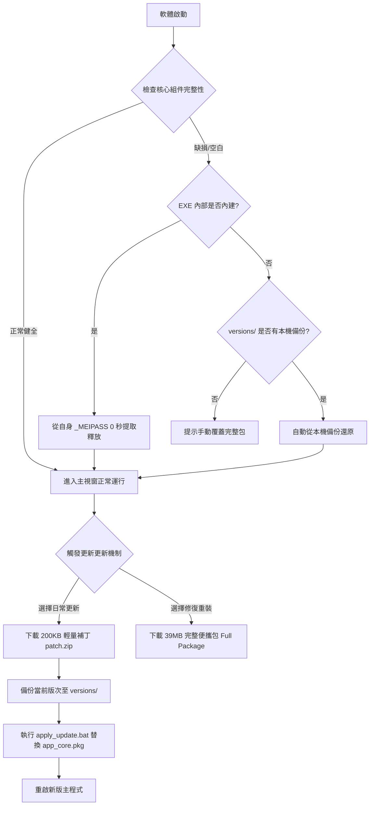

# Stock Portfolio Tracker - 系統檔案功能結構與運作架構說明書

本文件詳細分析 **Stock Portfolio Tracker (股票庫存管理系統)** 在使用者端（Portable 便攜運行目錄）中所有檔案的功能分工、架構關係、模組拆解機制與安全防護策略。

---

## 壹、 整體架構設計理念 (Architecture Overview)

為了徹底解決過去「全部功能捆綁在單一巨大執行檔 (39MB+)」所導致的：
1. **更新肥大**：每次小改版都必須重新下載整包 39MB 檔案。
2. **檔案鎖定衝突**：Windows Defender 或防毒軟體鎖定執行檔導致覆蓋失敗。
3. **資料庫混淆風險**：更新執行檔時可能意外影響到個人持股紀錄。

自 **V1.1.0.0** 起，系統全面升級為 **「三權分立模組化便攜架構」**：

```
[ 使用者便攜資料夾 (App Root) ]
 ├── 1. 外殼引導器 (Host Runner)      ─── Stock_Portfolio_Tracker.exe (原生引導與自癒)
 ├── 2. 二進位核心包 (Binary Core)     ─── app_core.pkg (業務邏輯位元碼，非明碼)
 ├── 3. 個人資料庫 (User Database)    ─── portfolio.db (個人資產與交易紀錄，永久隔離)
 ├── 4. 版本控制清單 (Manifest)        ─── version.json (雲端多版本指標與改版日誌)
 ├── 5. 本地歷史快照 (Local Backups)   ─── versions/ (更新前自動備份，支援秒級回滾)
 └── 6. 運作與更新日誌 (Debug Logs)    ─── update_debug.log (單一整合生命週期日誌)
```

---

## 貳、 使用者端各檔案功能詳細解析

以下為使用者目錄下各個核心檔案與資料夾的具體功能及權責：

### 1. `Stock_Portfolio_Tracker.exe` (主程式載入器 / Host Runner)
* **大小**：約 39.8 MB
* **權責**：系統的原生啟動引導器 (Bootstrap Runner)。
* **內部機制**：
  - **環境隔離初始化**：在 Windows 啟動時自動配置乾淨的環境變數，隔離 Python 依賴庫。
  - **動態二進位掛載**：優先將 `app_core.pkg` 掛載進 `sys.path[0]`，直接自非明碼二進位包載入業務模組。
  - **零感知內嵌自癒 (Self-Extracting Fallback)**：
    EXE 內部內建了一份備用的 `app_core.pkg` 與 `version.json`。若使用者僅複製 EXE 至全新目錄啟動，EXE 會在**開機 0 秒內自動自內部解壓釋放必要檔案**，完全不報錯、無需聯網即可自主生存。

---

### 2. `app_core.pkg` (非明碼二進位核心業務包)
* **大小**：約 200 KB
* **權責**：存放所有核心業務邏輯的二進位封裝包。
* **特性**：
  - **非明碼保護**：內部包含 12 個編譯後的 Python 位元碼 (`.pyc`)，使用者目錄不再有凌亂的外置 `.py` 明碼檔案，乾淨且防止誤改。
  - **輕量秒級更新目標**：日常功能修復、UI 優化或 API 調整時，**僅需下載此 200KB 檔案**即可完成升級，下載時間小於 1 秒。

---

### 3. `portfolio.db` (使用者專屬投資組合資料庫)
* **大小**：約 80 ~ 200 KB (隨記錄筆數增長)
* **權責**：本地 SQLite 關聯式資料庫，儲存所有個人持股與交易明細。
* **安全性與防護**：
  - **物理隔離原則**：任何軟體升級、補丁置換或歷史版本還原（Rollback），**絕對不觸碰、不覆寫 `portfolio.db`**。
  - **備份極度簡便**：使用者若要備份所有資產紀錄，**僅需單獨複製此檔案**至安全處即可。

---

### 4. `version.json` (版本配置與雲端更新清單)
* **大小**：約 3 KB
* **權責**：版本管理中樞，記錄本機版本與雲端更新通道定義。
* **欄位結構**：
  - `version`：當前軟體版號 (如 `V1.1.0.0`)。
  - `patch_url`：輕量更新補丁網址 (指向 `patch_V1.1.0.0.zip`，約 200KB)。
  - `full_package_url`：完整便攜包網址 (指向全套 Portable ZIP，供災難救援)。
  - `recent_versions`：**雲端最後三個版本清單**，供使用者在更新介面中自由挑選、降級或切換。
  - `changelog`：該版次的修復與新功能詳細公告。

---

### 5. `update_debug.log` (單一整合運作追蹤日誌)
* **權責**：遵循「單一整合日誌鐵律」，記錄程式運作與更新的所有關鍵事件。
* **記錄內容**：
  - 每次開機之時間戳記、進程 PID、版本號與環境變數。
  - 檢查更新連線狀態與雲端版本比對結果。
  - 下載進度、檔案大小校驗與防呆檢測。
  - 更新批次腳本執行細節與重啟狀態。

---

### 6. `versions/` (本地端版本迭代備份資料夾，選用)
* **權責**：本機歷史版本迭代快照庫。
* **運作機制**：
  - 當使用者點擊「立即更新」時，系統在下載覆蓋前，會**自動將當前版次的模組備份到 `versions/V1.x.x.x/`**。
  - 若更新後發現不相容或使用者想使用舊版，可在更新視窗點擊 **`[⏮ 還原本機前版]`**，一秒就地無痛倒退回前一版次。

---

### 7. `apply_update.bat` (動態臨時更新置換腳本)
* **權責**：更新重啟時由 Python 動態產生的獨立工作進程腳本。
* **運作流程**：
  1. 接收更新指令並在獨立進程中啟動。
  2. 優雅等待並終止舊版主程式 PID。
  3. 清除所有殘留之環境變數。
  4. 執行原子化檔案覆蓋（將補丁解壓或覆蓋 `app_core.pkg`）。
  5. 自動喚醒並重啟全新版次之主程式。
  6. 執行完畢後自行清理退場。

---

## 參、 核心二進位包 (`app_core.pkg`) 內部模組解構

二進位包 `app_core.pkg` 內部分解封裝了以下 12 個業務核心模組：

| 模組名稱 (`.pyc`) | 模組核心功能說明 |
|---|---|
| **`main_gui.py`** | 桌面 GUI 互動核心、深色主題排版、持股清單 DataGridView、資產儀表卡片與自定義設定。 |
| **`updater.py`** | 完整更新引擎：支援補丁更新、全包下載、雲端三版次挑選、本機歷史快照與一鍵還原。 |
| **`database.py`** | SQLite 資料庫底層封裝，包含持股增刪改查、歷史除權息紀錄、交易流水與自動結構遷移。 |
| **`quote_service.py`** | 即時報價引擎：多來源自動切換（富果 Fugle API、Yahoo Finance），支援自動輪詢與盤中更新。 |
| **`history_service.py`** | 盤後與歷史日 K 資料擷取模組，具備本地 JSON 快取機制，避免重複對外發起流量。 |
| **`dividend_service.py`** | 歷年除權息公告抓取、殖利率試算與現金/股票股利累計統計。 |
| **`pnl_calculator.py`** | 損益與報酬率精準結算引擎（包含現股、融資融券、手續費折讓與證交稅扣抵）。 |
| **`ranking_service.py`** | 盤後市場數據解析：上市櫃成交量排行、外資/投信三大法人買賣超排行、強弱勢排行。 |
| **`market_ranking_gui.py`**| 市場排行榜與法人動向獨立視覺化視窗。 |
| **`kline_chart.py`** | 專業互動式技術分析 K 線圖表繪製（MA 均線、成交量柱狀圖、Crosshair 游標捕捉）。 |
| **`splash_screen.py`** | 平滑開機啟動畫面，提供優雅的半透明漸變過渡與資源載入提示。 |
| **`integrity_checker.py`** | 開機健康完整性檢查與三級自癒引擎，負責防呆校驗與自動修復。 |

---

## 肆、 雙軌更新與極限失誤防範機制

本系統具備業界標準的防呆與自我修復閉環：



1. **日常秒級更新 (Patch Update)**：
   - 僅需下載 `dist_patches/patch_V1.1.0.0.zip` (約 200 KB)。
   - 更新僅替換 `app_core.pkg`，完全不需要碰 39MB 的 EXE，更新速度快、網路開銷極低。
2. **災難救援完整包 (Full Package)**：
   - 更新介面保留 **`[📦 下載完整包 (修復/重裝)]`** 按鈕。
   - 若發生任何環境損壞或跳版本升級，可一鍵下載整套免安裝包覆蓋修復。
3. **雲端最後三版次自選**：
   - 更新下拉選單提供最新 3 個版次切換，使用者可自主決定升級或降級。
4. **本機一鍵回滾 (Rollback)**：
   - 任何改動前自動在 `versions/` 建立快照，點擊「還原本機前版」即可瞬間倒退，無後顧之憂。

---

## 伍、 使用者備份與遷移指引 (User Portability SOP)

* **情境一：個人資料定期備份**
  - **SOP**：僅需備份 **`portfolio.db`** 即可。其他所有檔案皆為程式碼與靜態庫，隨時可重新下載。
* **情境二：更換電腦或隨身碟攜帶**
  - **SOP**：將整個資料夾整包複製到新電腦即可直接運行，無需安裝 Python 或任何相依套件（100% Portable 免安裝）。
