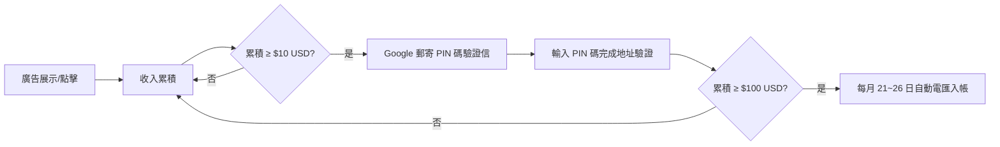

# 網頁遊戲廣告分潤完整分析報告

> 本文件針對類似《無盡洪荒》這類 HTML5 網頁小遊戲 / 放置遊戲，分析插入廣告的經濟效益、GitHub Pages 的合規性問題，以及可申請的廣告分潤平台。

---

## 壹、網頁遊戲廣告的實際經濟效益

### 1. 廣告收入核心指標

| 指標 | 說明 | 一般範圍 |
|------|------|----------|
| **CPM** (每千次展示成本) | 廣告被展示 1,000 次的收入 | $0.5 ~ $5 USD（亞洲流量偏低端） |
| **CPC** (每次點擊成本) | 用戶每點擊一次廣告的收入 | $0.05 ~ $0.50 USD |
| **CTR** (點擊率) | 廣告展示後被點擊的比率 | 0.5% ~ 3% |
| **RPM** (每千次頁面瀏覽收入) | 每 1,000 次頁面瀏覽的實際總收入 | $1 ~ $10 USD |

### 2. 不同流量規模的預估月收入

以下以 **Google AdSense** 為基準，假設 CPM ≈ $1.5（中文遊戲類流量偏低）：

| 日均 PV (頁面瀏覽) | 月 PV | 預估月收入 (USD) | 預估月收入 (TWD) |
|---------------------|--------|-------------------|-------------------|
| 100 | 3,000 | $4.5 | ~$145 |
| 500 | 15,000 | $22.5 | ~$720 |
| 1,000 | 30,000 | $45 | ~$1,440 |
| 5,000 | 150,000 | $225 | ~$7,200 |
| 10,000 | 300,000 | $450 | ~$14,400 |
| 50,000 | 1,500,000 | $2,250 | ~$72,000 |

> [!NOTE]
> 以上為粗估值。實際收入取決於流量來源地區（歐美流量 CPM 遠高於亞洲）、廣告類型、用戶停留時間與互動率。遊戲類頁面因用戶停留時間長，通常 RPM 會略高於一般網頁。

### 3. 遊戲類網頁的廣告優劣勢

**優勢：**
- ✅ 用戶停留時間長（放置/掛機遊戲動輒數十分鐘），廣告曝光次數多
- ✅ 可設計「看廣告獲得遊戲獎勵」的激勵式廣告 (Rewarded Ads)，點擊率遠高於普通橫幅
- ✅ 用戶黏著度高，回訪率佳

**劣勢：**
- ❌ 中文遊戲類流量 CPM 偏低（$0.5 ~ $2），不如歐美英語流量
- ❌ 小型獨立遊戲初期流量有限，短期內難以產生可觀收入
- ❌ 過多廣告會嚴重影響遊戲體驗與用戶留存率

---

## 貳、在 GitHub Pages 上插入廣告是否違規？

### 1. GitHub Pages 官方使用條款摘要

根據 [GitHub Pages 使用條款](https://docs.github.com/en/pages/getting-started-with-github-pages/about-github-pages)：

> [!WARNING]
> **GitHub Pages 並非用於商業用途。** 官方明確指出：
> - GitHub Pages **不得作為免費的網頁託管服務來運營商業網站**。
> - 明確禁止將 GitHub Pages 用作「線上商店」或主要商業交易平台。
> - 存在頻寬限制（每月 100 GB 軟上限）與建構頻率限制（每小時 10 次）。

### 2. 插入廣告的合規風險評估

| 情境 | 風險等級 | 說明 |
|------|----------|------|
| 個人專案頁面放少量 AdSense 橫幅 | 🟡 **灰色地帶** | GitHub 官方未明確禁止「少量廣告」，但也未允許。多數小型專案放 1~2 個橫幅通常不會被處理，但**理論上仍可能違反條款**。 |
| 大量廣告 + 高流量商業化運營 | 🔴 **高風險** | 明確違反 GitHub Pages 的「非商業用途」條款，可能被停用頁面甚至帳號。 |
| 開源專案的贊助/Donate 連結 | 🟢 **安全** | GitHub 官方支援 GitHub Sponsors，放贊助連結完全合規。 |

### 3. 結論與建議

> [!IMPORTANT]
> **如果你打算認真透過廣告獲利，強烈建議不要依賴 GitHub Pages。** 應將網站部署到以下允許商業用途的平台：
> - **Cloudflare Pages**（免費方案即可，無商業限制）
> - **Vercel**（免費方案支援個人商業專案）
> - **Netlify**（免費方案，允許廣告）
> - **自有 VPS**（完全自主控制，如 AWS Lightsail、DigitalOcean、Linode）

---

## 參、可申請廣告分潤的平台一覽

### 1. 主流廣告聯播網

| 平台 | 門檻 | 分潤比例 | 適合對象 | 備註 |
|------|------|----------|----------|------|
| **[Google AdSense](https://adsense.google.com/)** | 需審核（網站需有原創內容、符合政策） | 約 68% 歸發佈者 | 所有網站 | 最主流、最穩定，支援多種廣告格式（橫幅、原生、自動廣告） |
| **[Google Ad Manager](https://admanager.google.com/)** | 進階版，需一定流量規模 | 視合約而定 | 中大型網站 | 可搭配 AdSense + 第三方廣告來源，最大化收益 |
| **[Media.net](https://www.media.net/)** | 需審核（偏好英語內容） | 與 AdSense 相當 | 英語流量網站 | Yahoo/Bing 廣告聯播網，中文站較不友善 |
| **[Ezoic](https://www.ezoic.com/)** | 月 PV > 10,000 (2024 年起降低門檻) | 動態優化 | 中型網站 | AI 自動優化廣告版位，收入通常比純 AdSense 高 20~50% |
| **[Mediavine](https://www.mediavine.com/)** | 月 Sessions > 50,000 | 75% 歸發佈者 | 中大型網站 | 高端廣告網路，RPM 極高但門檻也高 |
| **[AdThrive (Raptive)](https://raptive.com/)** | 月 PV > 100,000 | 75%+ | 大型網站 | 頂級廣告網路，僅接受高流量優質站點 |

### 2. 遊戲專用廣告平台（適合 HTML5 遊戲）

| 平台 | 特色 | 適合 |
|------|------|------|
| **[GameDistribution](https://gamedistribution.com/)** | 專門為 HTML5 遊戲設計的廣告 SDK，支援插頁式廣告與激勵式廣告 | HTML5 小遊戲開發者 |
| **[CrazyGames](https://www.crazygames.com/for-developers)** | 上傳遊戲到平台，由平台負責流量與廣告，開發者獲得分潤 | 想要曝光的小遊戲 |
| **[Poki](https://developers.poki.com/)** | 全球最大 HTML5 遊戲平台之一，流量極高，有開發者分潤計畫 | 品質較高的 HTML5 遊戲 |
| **[游戲茶苑 / 4399 等中文平台](https://www.4399.com/)** | 中文 H5 遊戲聯運平台，流量大但分潤比例較低 | 面向中文玩家的小遊戲 |

### 3. 其他變現方式（非廣告）

| 方式 | 說明 | 適用場景 |
|------|------|----------|
| **GitHub Sponsors** | 玩家/用戶直接贊助你，GitHub 不抽成 | 開源遊戲專案 |
| **Buy Me a Coffee / Ko-fi** | 小額打賞平台，嵌入按鈕即可 | 獨立開發者 |
| **Patreon** | 月費訂閱制，提供獨家內容或早期體驗 | 有持續更新內容的遊戲 |
| **遊戲內購 (IAP)** | 販售虛擬道具、VIP 時間、外觀皮膚等 | 有一定玩家基礎的遊戲 |
| **聯盟行銷 (Affiliate)** | 在遊戲頁面推薦相關產品/服務賺取佣金 | 有穩定流量的站點 |

---

## 肆、我的建議行動方案

> [!TIP]
> **階段式變現策略**（從零開始到穩定獲利）：

### 第一階段：累積流量（0 ~ 1,000 日均 PV）
1. 先專注遊戲品質與玩法迭代，不急著插入廣告。
2. 在 GitHub Pages 上線作為展示，搭配 GitHub Sponsors 或 Buy Me a Coffee 按鈕收集打賞。
3. 投稿到 CrazyGames / Poki / GameDistribution 等遊戲平台獲得額外曝光。

### 第二階段：申請廣告（1,000+ 日均 PV）
1. 將網站遷移到 **Cloudflare Pages** 或 **Vercel**（免費且允許商業用途）。
2. 申請 **Google AdSense**，放置 1~2 個不影響遊戲體驗的橫幅廣告。
3. 考慮加入 **GameDistribution SDK**，在遊戲關卡切換時插入插頁式廣告。

### 第三階段：優化收益（5,000+ 日均 PV）
1. 切換至 **Ezoic** 或申請 **Mediavine**，利用 AI 自動優化廣告版位。
2. 加入「看廣告獲得遊戲獎勵」激勵式廣告機制（Rewarded Ads）。
3. 開始考慮遊戲內購 (IAP) 與 Patreon 訂閱制。

---

## 伍、關鍵數據速查表

| 問題 | 答案 |
|------|------|
| 日均 100 PV 能賺多少？ | 約 $4.5 USD/月（~$145 TWD） |
| 日均 1,000 PV 能賺多少？ | 約 $45 USD/月（~$1,440 TWD） |
| GitHub Pages 能放廣告嗎？ | ⚠️ 灰色地帶，少量可能沒事，但理論上違反條款 |
| 最推薦的廣告平台？ | 初期 Google AdSense；中期 Ezoic；遊戲專用 GameDistribution |
| 最推薦的免費商業託管？ | Cloudflare Pages 或 Vercel |

---

## 陸、Google AdSense 完整申請與使用教學

### 1. 什麼是 Google AdSense？

Google AdSense 是 Google 旗下最大的廣告聯播網服務，讓網站擁有者（發佈者）在自己的網頁上展示 Google 投放的廣告，當訪客瀏覽或點擊廣告時，發佈者即可獲得收入。Google 會自動根據網站內容與訪客興趣投放最相關的廣告。

- **分潤比例**：展示型廣告收入的 **80%** 歸發佈者（2024 年起調整），搜尋廣告收入的 **51%** 歸發佈者。
- **支付門檻**：累積收入達 **$100 USD** 後方可提領。
- **支援幣別**：依帳戶地區而定，台灣帳戶以 USD 計算，透過電匯入台灣銀行帳戶。

---

### 2. 申請前的準備條件

> [!IMPORTANT]
> AdSense 審核逐年趨嚴。以下條件務必在申請前確認到位：

| 條件 | 要求 | 說明 |
|------|------|------|
| **自有網域** | ✅ 必要 | 需使用自己的頂級網域（如 `yourgame.com`）。GitHub Pages 的 `username.github.io` **可以申請**，但自訂網域審核通過率更高。 |
| **原創內容** | ✅ 必要 | 網站需有足夠的原創內容（建議至少 15~20 頁有意義的內容頁面）。純遊戲頁面建議搭配說明頁、攻略頁、更新日誌等。 |
| **隱私權政策頁面** | ✅ 必要 | 必須提供隱私權政策（Privacy Policy）頁面，說明網站如何使用 Cookie 與收集資料。 |
| **網站運營時長** | 🟡 建議 | 建議網站至少運營 **1~3 個月** 以上再申請，全新網站容易被拒。 |
| **流量** | 🟡 建議 | 無官方最低流量要求，但有穩定日均流量（50+ PV/日以上）會大幅提高審核通過率。 |
| **年齡** | ✅ 必要 | 申請者需年滿 **18 歲**。 |
| **符合內容政策** | ✅ 必要 | 不得有成人、暴力、仇恨、盜版、賭博等違規內容。 |

---

### 3. 完整申請步驟（Step by Step）

#### Step 1：建立 Google AdSense 帳戶
1. 前往 [https://adsense.google.com/](https://adsense.google.com/)
2. 使用你的 Google 帳戶登入（建議使用與 YouTube、Google Analytics 同一個帳戶）
3. 輸入你的網站網址（例如 `https://yourgame.com`）
4. 選擇你的國家/地區（台灣）

#### Step 2：嵌入驗證代碼到網站
AdSense 會給你一段驗證用的 `<script>` 標籤，需要貼到你網站的 `<head>` 區塊中：

```html
<head>
  <!-- Google AdSense 驗證碼 (申請審核用) -->
  <script async src="https://pagead2.googlesyndication.com/pagead/js/adsbygoogle.js?client=ca-pub-你的發佈者ID"
     crossorigin="anonymous"></script>
</head>
```

> [!NOTE]
> 這段代碼在審核期間只用於驗證網站所有權，不會顯示任何廣告。審核通過後才會開始投放。

#### Step 3：填寫付款資訊
- 輸入你的真實姓名與郵寄地址（Google 會郵寄 **PIN 碼驗證信**）
- 設定收款方式（台灣建議使用「電匯至銀行帳戶」）

#### Step 4：等待審核
- 審核時間通常為 **1~14 天**，部分網站可能長達 1 個月
- 審核期間網站需持續運營，不可關閉
- Google 會通過 Email 通知審核結果

#### Step 5：審核通過 → 開始設定廣告單元
- 審核通過後，登入 AdSense 後台 → 「廣告」→ 建立廣告單元
- 選擇廣告格式、複製代碼、貼到網頁中對應位置

---

### 4. 廣告格式選擇與建議

| 廣告格式 | 代碼範例 | 建議使用位置 | 適合遊戲頁面？ |
|----------|----------|------------|---------------|
| **自動廣告 (Auto Ads)** | 只需加入一行 `<script>`，Google AI 自動判斷最佳版位 | 全站自動 | ✅ 最省事，推薦新手 |
| **展示型廣告 (Display Ads)** | 手動指定區塊大小與位置 | 頁面頂部/底部/側邊欄 | ✅ 遊戲頁面頂部或底部 |
| **信息流內廣告 (In-feed Ads)** | 插入在內容列表之間 | 攻略列表、更新日誌 | 🟡 適合有多篇內容的站 |
| **文章內廣告 (In-article Ads)** | 插入在文章段落之間 | 攻略文、說明文 | 🟡 適合有長文的站 |
| **多媒體廣告 (Multiplex Ads)** | 格子狀推薦廣告 | 頁面底部 | ✅ 不干擾遊戲體驗 |

#### 遊戲頁面推薦的廣告代碼嵌入範例

```html
<!-- 方法一：自動廣告（最簡單，Google AI 自動投放） -->
<head>
  <script async src="https://pagead2.googlesyndication.com/pagead/js/adsbygoogle.js?client=ca-pub-你的ID"
     crossorigin="anonymous"></script>
</head>

<!-- 方法二：手動在遊戲區域上方放一個橫幅 -->
<div style="text-align:center; margin:10px 0;">
  <ins class="adsbygoogle"
     style="display:inline-block;width:728px;height:90px"
     data-ad-client="ca-pub-你的ID"
     data-ad-slot="你的廣告單元ID"></ins>
  <script>
     (adsbygoogle = window.adsbygoogle || []).push({});
  </script>
</div>

<!-- 方法三：響應式廣告（自適應大小，推薦手機版） -->
<div style="text-align:center; margin:10px 0;">
  <ins class="adsbygoogle"
     style="display:block"
     data-ad-client="ca-pub-你的ID"
     data-ad-slot="你的廣告單元ID"
     data-ad-format="auto"
     data-full-width-responsive="true"></ins>
  <script>
     (adsbygoogle = window.adsbygoogle || []).push({});
  </script>
</div>
```

---

### 5. 遊戲網頁廣告版位最佳實踐

> [!TIP]
> 遊戲頁面放廣告的關鍵原則：**不干擾遊戲體驗，但確保可見度。**

```
┌─────────────────────────────────────────┐
│          頂部橫幅廣告 (728x90)           │  ← 推薦位置 ①
├─────────────────────────────────────────┤
│                                         │
│           遊 戲 主 畫 面                 │  ← 遊戲區域不放廣告
│                                         │
├─────────────────────────────────────────┤
│          底部橫幅廣告 (728x90)           │  ← 推薦位置 ②
├─────────────────────────────────────────┤
│     多媒體推薦廣告 (Multiplex Ads)       │  ← 推薦位置 ③
└─────────────────────────────────────────┘
```

**Do's ✅：**
- 頂部或底部放 1~2 個橫幅即可
- 使用響應式廣告適配手機螢幕
- 在攻略頁 / 更新日誌頁面多放幾個廣告（文章內廣告）
- 使用自動廣告讓 Google AI 幫你優化

**Don'ts ❌：**
- 不要在遊戲畫面中央疊加廣告
- 不要放超過 3 個以上的廣告單元在同一頁面
- 不要使用彈出式（Pop-up）廣告，嚴重影響體驗且可能違反 AdSense 政策
- 不要誘導用戶點擊廣告（如「請點擊廣告支持我們」），這是 **嚴重違規行為**

---

### 6. 收款流程與門檻



| 里程碑 | 門檻金額 | 說明 |
|--------|----------|------|
| 地址驗證 (PIN) | $10 USD | 收入首次達 $10 後，Google 郵寄實體 PIN 碼到你的地址 |
| 收款門檻 | $100 USD | 每月底結算，累積達 $100 後於次月 21~26 日自動電匯 |
| 台灣電匯手續費 | 約 $300~$600 TWD/次 | 由收款銀行收取，建議累積較高金額再提領 |

> [!NOTE]
> **台灣收款建議**：使用國泰世華、玉山銀行或台新銀行，電匯手續費較低（約 $200~$400 TWD）。部分銀行對小額外匯可能不友善，建議事前電話詢問。

---

### 7. 常見審核被拒原因與解決方案

| 拒絕原因 | 說明 | 解決方式 |
|----------|------|----------|
| **內容不足 (Insufficient Content)** | 網站頁面太少或內容空洞 | 增加攻略頁、FAQ、更新日誌、關於我們等頁面，確保至少 15+ 頁有意義的內容 |
| **導覽問題 (Navigation Issues)** | 網站缺乏明確的導覽選單或頁面間連結 | 加入完整的導覽列、頁尾連結、麵包屑導覽 |
| **違反內容政策** | 含有成人、暴力、賭博等內容 | 移除違規內容，遊戲頁面避免過度血腥暴力描述 |
| **網站正在建設中** | 有「Coming Soon」或大量佔位符內容 | 確保所有頁面都有完整內容，移除所有佔位文字 |
| **流量來源問題** | 使用機器人流量或異常流量 | 只使用有機流量（搜尋引擎、社群媒體、直接訪問） |
| **重複申請** | 短時間內多次申請被拒 | 每次被拒後至少等 **2~4 週**，修改後再重新申請 |

---

### 8. 針對《無盡洪荒》遊戲頁面的 AdSense 申請建議

> [!IMPORTANT]
> 純單頁遊戲直接申請 AdSense **通過率極低**。建議搭配以下策略：

1. **擴充為多頁面網站**：
   - 首頁（遊戲入口）
   - 遊戲攻略頁（五行相生相剋解說、鍛造指南、秘境攻略）
   - 更新日誌頁（每次版本更新的記錄）
   - 關於專案 / 開發者頁面
   - 隱私權政策頁面（必要！）
   - FAQ 常見問題頁面

2. **使用自訂網域**：
   - 購買一個便宜的網域（如 `wujinhonghuang.com`），年費約 $300~$500 TWD
   - 繫結到 Cloudflare Pages 或 Vercel（免費託管）

3. **確保 SEO 基礎**：
   - 每頁都有獨立的 `<title>` 與 `<meta description>`
   - 使用語意化 HTML 標籤（`<header>`, `<main>`, `<article>`, `<footer>`）
   - 提交 Sitemap 到 Google Search Console

4. **申請時機**：
   - 網站上線至少 1 個月以上
   - 有穩定的自然流量（即使每天只有 30~50 PV）
   - 所有頁面內容完整，無佔位符或空白頁

---

*文件建立日期：2026-07-31 | 適用範圍：HTML5 網頁遊戲廣告變現策略*
